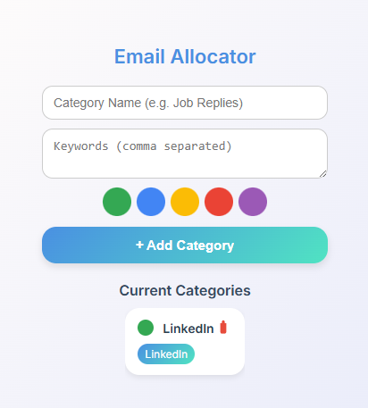
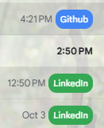

<div align="center">

  <h1>📨 Email Allocator</h1>

  <p>
    <b>Declutter your inbox visually.</b> <br>
    A lightweight browser extension that automatically categorizes and badges your Gmail threads based on custom keywords.
  </p>

  <p>
    
    
    
  </p>

</div>

---

## 📖 Overview

**Email Allocator** helps you scan your inbox faster. Instead of reading every subject line, simply define keywords (e.g., "Invoice", "Urgent", "Newsletter") and assign them a color. The extension dynamically injects badges into your Gmail interface, helping you prioritize what matters instantly.

## ✨ Features

* **🎨 Custom Categories:** Create unlimited keyword groups with your own color codes.
* **⚡ Real-time Badging:** Automatically scans and tags emails as they load.
* **🔒 Privacy Focused:** Runs entirely locally in your browser. No data is sent to external servers.
* **🌐 Chromium Compatible:** Works seamlessly on Google Chrome, Brave, Edge, and Opera.

---

## 📸 Screenshots

| **Popup Interface** | **In-Inbox Example** |
|:---:|:---:|
|  |  |
| *Easy-to-use configuration menu* | *Badges appear next to subject lines* |

---

## 🛠 Built With

*  **Core Logic**
*  **Popup UI**
*  **Styling**
* **Chrome Extension API** (Manifest V3)

---

## 🚀 Installation (Developer Mode)

Since this is a developer version, you will load it manually:

1.  **Clone the repository** (or download the ZIP):
    ```bash
    git clone [https://github.com/Janith19/email-allocator.git](https://github.com/Janith19/email-allocator.git)
    ```
2.  Open your browser and navigate to the Extensions page:
    * **Chrome:** Enter `chrome://extensions/` in the URL bar.
    * **Edge:** Enter `edge://extensions/`.
3.  **Enable Developer Mode:**
    * Look for the toggle switch in the top-right corner of the page and turn it **ON**.
4.  **Load the Extension:**
    * Click the **"Load unpacked"** button (top-left).
    * Select the folder where you cloned/downloaded this project.

✅ *The extension icon should now appear in your toolbar!*

---

## ⚙️ How to Use

1.  Click the **Email Allocator** icon in your browser toolbar.
2.  Enter a **Keyword** (e.g., `DevOps`).
3.  Select a **Color** (e.g., `#FF5733`).
4.  Click **Add**.
5.  Refresh your Gmail tab to see your new badges in action!

---

## 📄 License

Distributed under the MIT License. See `LICENSE` for more information.
